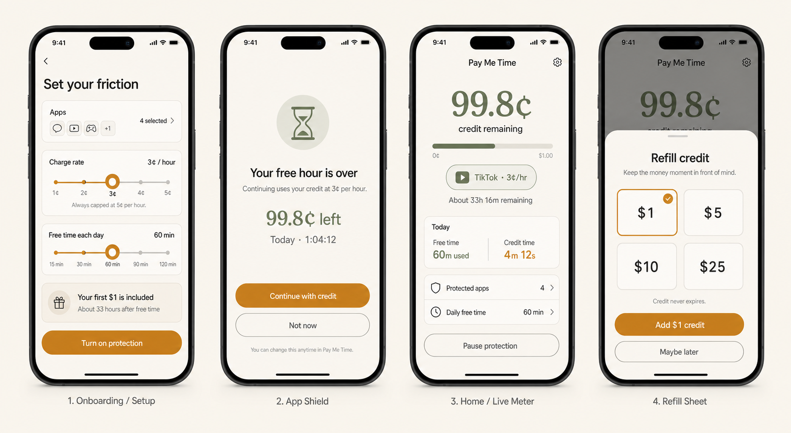
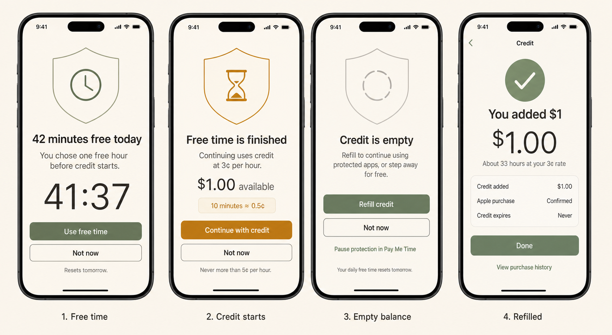

# Product mocks

Generated July 25, 2026 with the built-in image generation tool.

## Core flow



The first board establishes the product's visual language and four primary surfaces:

1. Configure protected apps, a 1–5¢ hourly rate, and free daily time.
2. Reach a calm Screen Time shield after free time is used.
3. See remaining commitment credit as the dominant figure in the app.
4. Refill with $1, $5, $10, or $25 of non-expiring credit.

## Meter states



The second board covers the lifecycle:

1. Free daily allowance remains.
2. Free time ends and the user explicitly starts a credit-backed access window.
3. Credit is empty and selected apps are shielded.
4. A StoreKit refill is confirmed.

## Feasibility corrections for implementation

The boards are product-direction mocks, not literal claims about Screen Time extension capabilities.

- An Apple-managed shield supports an icon, title, subtitle, primary action, and optional secondary action. It is not an arbitrary SwiftUI screen.
- A shield can show a balance or remaining-time snapshot when it is configured. It cannot host a continuously ticking custom meter.
- The main app can animate a live access-window countdown. A Live Activity may later expose that countdown outside the app. Neither surface proves continuous foreground use of another app.
- StoreKit purchase UI must be presented by the containing app, not inside the shield action extension.
- The user should configure a default fixed access window (5, 15, or 30 minutes). After free time is exhausted, the shield can offer that one exact, priced window. The displayed hourly rate remains the user's mental anchor.

The implementation copy should therefore evolve from “Continue with credit” to an exact action such as:

> Start 15 min · 0.8¢

At 3¢ per hour, exact window prices are 0.25¢ for 5 minutes, 0.75¢ for 15 minutes, and 1.5¢ for 30 minutes.

## Design system

| Role | Light direction | Dark direction |
| --- | --- | --- |
| Canvas | Warm ivory `#F6F1E8` | Near-black warm charcoal |
| Surface | Soft paper white | Raised charcoal |
| Primary text | Charcoal `#272521` | Warm white |
| Secondary text | Stone gray | Muted warm gray |
| Action / warning | Amber `#C88724` | Lighter amber |
| Free / safe state | Sage `#6F8068` | Lighter sage |
| Hairline | Low-contrast stone | Low-contrast warm gray |

Use SF Pro for interface text and a native serif display face only for the large balance. Prefer hairlines over shadows, moderate button radii, SF Symbols, large tap targets, and calm recovery language.

Avoid coins, gems, streaks, moral grades, aggressive red, celebratory loss animations, fake precision, and any suggestion that the voluntary Screen Time authorization cannot be bypassed.

## Image-generation prompts

### Core-flow board

```text
Use case: ui-mockup
Asset type: high-fidelity native iPhone app product-design board
Primary request: Four screens for Screenbump: configuration, Screen Time shield,
live balance home, and refill sheet. The product uses a $1 included prepaid balance,
a user-selected rate capped at 5¢ per hour, configurable free daily time, and $1,
$5, $10, or $25 refills.
Style: native SwiftUI, iOS 18, calm financial instrument, warm-neutral surfaces,
charcoal text, amber action accent, sage free-time accent, editorial and accessible.
Constraints: real USD commitment credit, no coins or points, no third-party logos,
implementable native controls, no shame, gamification, neon, or aggressive red.
```

### Meter-state board

```text
Use case: ui-mockup
Asset type: high-fidelity native iPhone state-flow board
Primary request: Four consecutive states for Screenbump: free time remaining,
free time finished and credit starts, empty credit, and a confirmed $1 refill.
Style: native SwiftUI and Screen Time-inspired surfaces, restrained warm neutrals,
amber attention accent, sage safe-state accent, legible and calm.
Constraints: show a 5¢/hour hard cap, make the depleted state recoverable rather
than punitive, keep protected apps shielded at an empty balance, and show that
credit does not expire.
```
